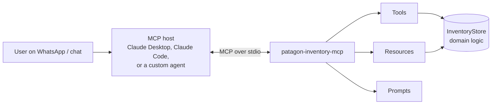

# patagon-inventory-mcp

[](https://github.com/Sr-Stark08/patagon-inventory-mcp/actions/workflows/ci.yml)


An **MCP (Model Context Protocol) server** that lets an AI agent manage inventory through natural language —
check stock, register entries and exits, and flag low-stock items — **without ever inventing a number**.

It is a small, open-source extraction of patterns I use in production at
[Patagon](https://patagoninventario.cl), a B2B platform where AI agents run day-to-day operations for SMBs
over WhatsApp. It uses sample data only.

> *"Se gastaron 10 cascos en la faena norte"* → the agent calls `register_movement` → stock goes 38 → 28,
> and if the same WhatsApp message is delivered twice, it is still counted **once**.

---

## Why this exists

When an LLM manages real inventory, three things go wrong:

| Problem | How this server handles it |
|---|---|
| The model **hallucinates** stock figures | Every number comes from a tool. Tool descriptions and the `stock_report` prompt tell the model to never estimate. |
| Messages get **retried or duplicated** (webhooks, flaky networks) | `register_movement` is **idempotent**: same `idempotency_key` → same result, stock unchanged. Reusing a key for a *different* movement is rejected. |
| The model **claims success** when something failed | Invalid operations return an explicit MCP tool error (`isError: true`) with a code the model can reason about: `NOT_FOUND`, `INSUFFICIENT_STOCK`, `INVALID_QUANTITY`, `KEY_CONFLICT`. |

## Architecture



The domain logic (`src/inventory.ts`) knows nothing about MCP, so it can be unit-tested in isolation and
reused behind any transport. `src/server.ts` is a thin MCP layer on top of it.

## What it exposes

**Tools** (model-controlled)

| Tool | Description |
|---|---|
| `list_products` | List products, optionally filtered by SKU or name |
| `get_stock` | Current stock of one product, with status `ok` / `low` / `out` |
| `register_movement` | Register an `in` or `out` movement — idempotent via `idempotency_key` |
| `list_low_stock` | Products below their minimum, with units missing |
| `get_movement_history` | Recent movements, newest first |

Tools carry MCP annotations (`readOnlyHint`, `idempotentHint`) so hosts can decide which calls need user confirmation.

**Resources** (application-controlled)

- `inventory://products` — full catalog snapshot
- `inventory://products/{sku}` — resource **template** with listing and SKU autocompletion

**Prompts** (user-controlled)

- `stock_report` — a reusable, tested instruction for a short team report, grounded in tool data

## Quick start

Requires Node.js 20+.

```bash
git clone https://github.com/Sr-Stark08/patagon-inventory-mcp.git
cd patagon-inventory-mcp
npm install
npm run build
```

### Try it in the MCP Inspector

```bash
npm run inspect
```

### Use it from Claude Desktop

Add this to your `claude_desktop_config.json`:

```json
{
  "mcpServers": {
    "patagon-inventory": {
      "command": "node",
      "args": ["/absolute/path/to/patagon-inventory-mcp/dist/index.js"]
    }
  }
}
```

### Use it from Claude Code

```bash
claude mcp add patagon-inventory -- node /absolute/path/to/patagon-inventory-mcp/dist/index.js
```

### Run with Docker

```bash
docker build -t patagon-inventory-mcp .
docker run -i --rm patagon-inventory-mcp
```

## Tests

```bash
npm test
```

- **Unit tests** for the domain rules: idempotency, key conflicts, no negative stock, input validation,
  minimum-stock crossing.
- **End-to-end tests** that connect a real MCP `Client` to the server over an in-memory transport and exercise
  tools, resource templates and prompts through the protocol.

CI (GitHub Actions) runs type-checking, tests and the build on Node 20 and 22, then builds the Docker image and
smoke-tests it over stdio.

## Project structure

```
src/
  inventory.ts   # domain logic: products, movements, idempotency, validation
  server.ts      # MCP layer: tools, resources, prompts
  index.ts       # stdio entry point
tests/
  inventory.test.ts
  server.test.ts
```

## Limitations and next steps

- Data is **in memory** with sample products; a restart resets it. The store is isolated so it can be swapped for
  PostgreSQL or SQLite without touching the MCP layer.
- Only the **stdio** transport is wired up. A Streamable HTTP entry point would enable remote deployments.
- No authentication — intended for local use by an MCP host.

## Author

**Jorge Fraile Pereira** — AI Agent Developer, founder of [Patagon](https://patagoninventario.cl).
Anthropic Academy: Building with the Claude API · Model Context Protocol (Intro & Advanced) · Claude Code in Action.

License: [MIT](LICENSE)
